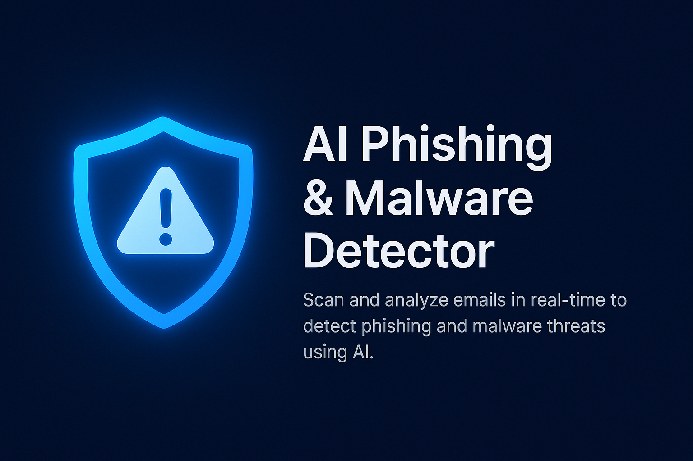
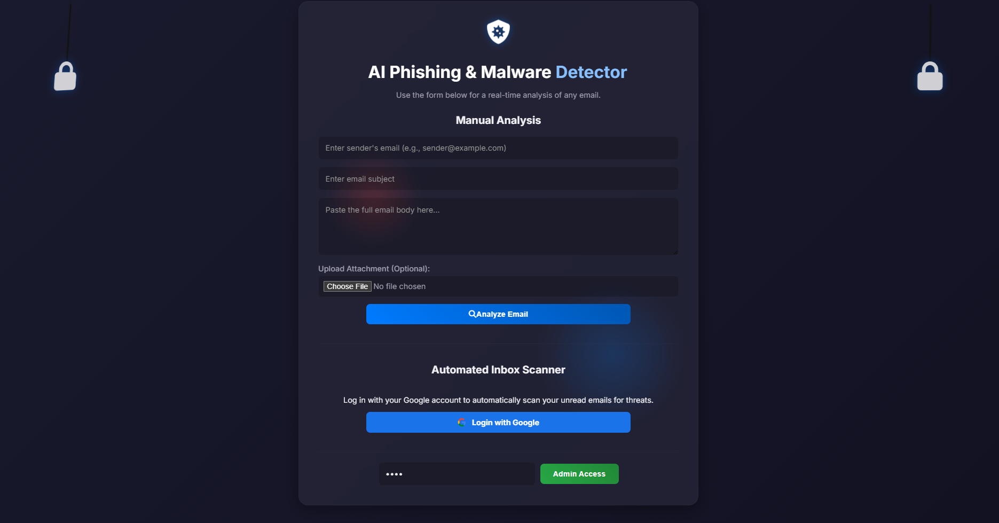
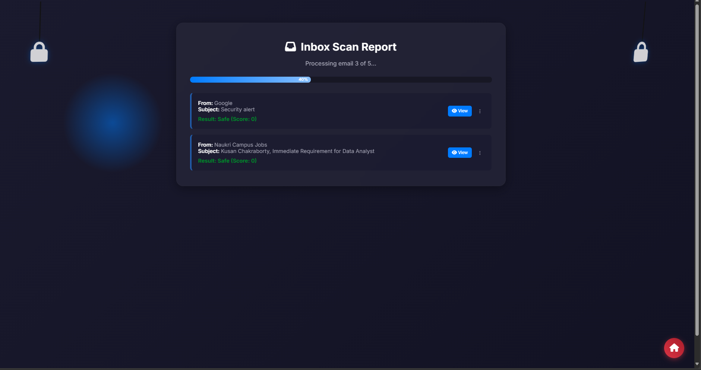

# AI Phishing Email Detector 🎣

This is a powerful web-based Phishing Email Detector built with Flask and Python. The application uses a hybrid approach to analyze emails, combining heuristic rule-based scoring, live API lookups (VirusTotal, Google Safe Browsing), and a machine learning model to provide a comprehensive threat assessment.

## ✨ Features

  * **Manual Analysis:** Paste email headers, subject, and body for an instant phishing score.
  * **Gmail Inbox Scan:** Securely log in with Google OAuth to scan your 5 most recent unread emails.
  * **Attachment Malware Scan:** Upload files to check them against the VirusTotal database for known malware.
  * **Hybrid Scoring System:**
      * **Heuristic Rules:** Checks for common phishing tactics like sender impersonation, urgency keywords, suspicious links, and generic greetings.
      * **Live API Checks:** Scans URLs and attachments in real-time using Google Safe Browsing and VirusTotal.
      * **AI-Powered Detection:** A machine learning model (Logistic Regression) analyzes email text patterns to identify suspicious content.
  * **Feedback & Retraining:** An admin panel allows for viewing user feedback and retraining the AI model on the fly to improve its accuracy.
  * **Secure & Scalable:** Uses MongoDB for database storage and environment variables for secure key management.

-----

## Project ##



## 📂 File Structure

Here are the essential files and directories for this project:

| File / Folder             | Purpose                                                                  |
| ------------------------- | ------------------------------------------------------------------------ |
| **`app.py`**              | Core Flask application with routes, analysis logic, and API integrations |
| **`.env`**                | Stores secret keys and environment variables (API keys, DB URI, etc.)    |
| **`client_secret.json`**  | Google OAuth 2.0 client credentials from Google Cloud Console            |
| **`requirements.txt`**    | List of Python libraries required for the project                        |
| **`train_and_upload.py`** | Script to pre-train AI model and upload it to MongoDB                    |
| **`/templates`**          | Contains HTML files (`index.html`, `result.html`, etc.)                  |
| **`/static`**             | Contains CSS, JavaScript, and image files                                |


-----

## 🛠️ Core Technologies & Libraries

This project relies on several key libraries and services:

| Library / Technology          | Purpose                                                                             |
| ----------------------------- | ----------------------------------------------------------------------------------- |
| **Flask**                     | Lightweight Python web framework to build the server and handle requests            |
| **MongoDB (Pymongo)**         | NoSQL database for storing AI model and user feedback emails                        |
| **Scikit-learn**              | ML library for text vectorization (TF-IDF) and classification (Logistic Regression) |
| **Google OAuth & API Client** | Authenticates users with Google and fetches emails via Gmail API                    |
| **Requests**                  | For making HTTP requests to external APIs (VirusTotal, Safe Browsing)               |
| **BeautifulSoup4**            | Extracts clean text from HTML email bodies                                          |
| **thefuzz**                   | Fuzzy string matching to detect brand name typo-squatting                           |
| **python-dotenv**             | Manages environment variables (keeps secrets outside main code)                     |
| **Hugging Face datasets**     | Enables large-scale datasets for advanced NLP model integration                     |
| **python-whois**              | Performs WHOIS queries on email domains for forensics                               |
| **Pandas & NumPy**            | Data manipulation & handling feedback data during model retraining                  |
| **Gunicorn**                  | Production-ready server to deploy Flask app efficiently                             |

-----

## 🚀 How to Run the Project

Follow these steps to set up and run the application on your local machine.

### 1\. Prerequisites

  * Python 3.8 or higher
  * A MongoDB Atlas account (or a local MongoDB server)
  * A Google Cloud Platform account
  * A VirusTotal API Key

### 2\. Setup & Installation

1.  **Clone the Repository**

    ```

    git clone <your-repository-url>
    cd <repository-name>

    ```

2.  **Create a Virtual Environment**

    ```

    python -m venv venv
    source venv/bin/activate  # On Windows, use `venv\Scripts\activate`

    ```

3.  **Install Dependencies**
    There is a `requirements.txt` file with the libraries listed above and run:

    ```

    pip install -r requirements.txt
    
    ```

4.  **Set up Google OAuth Credentials**

      * Go to the [Google Cloud Console](https://console.cloud.google.com/).
      * Create a new project.
      * Go to **APIs & Services \> Credentials**.
      * Create an **OAuth 2.0 Client ID** for a **Web application**.
      * Add `http://127.0.0.1:5000/oauth2callback` to the **Authorized redirect URIs**.
      * Click **DOWNLOAD JSON** and save the file in your project's root directory as `client_secret.json`.

5.  **Create the `.env` File**
    Create a file named `.env` in the root directory and add the following, replacing the placeholders with your actual keys and secrets:

    ```env
    # Flask Configuration
    FLASK_SECRET_KEY='<a-long-random-string-for-sessions>'

    # API Keys
    VT_API_KEY='<your-virustotal-api-key>'
    GOOGLE_API_KEY='<your-google-cloud-api-key-for-safe-browsing>'

    # Database
    MONGO_URI='<your-mongodb-connection-string>'

    # Admin Panel
    RETRAIN_SECRET_KEY='<a-secret-password-for-the-admin-panel>'
    ```

### 3\. Running the Application

1.  **Run the Flask App**
    With your virtual environment activated, run the main application file:

    ```
    flask run
    ```
    Alternatively:

    ```
    python app.py
    ```
2.  **Access the Web Interface**
    Open your web browser and go to `http://127.0.0.1:5000`. You can now use the application to analyze emails\!


## 📸 Preview

  



🤝 Contributing Feel free to fork the repository, make improvements, and submit pull requests.


## 📜 License

MIT License © 2025 Kusan Chakraborty
